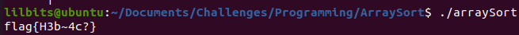

---
title: "CWE Challenge - Array Sort"
author: Michael Mendoza
date: "2023-01-30"
subject: "C Programming"
keywords: [CTF, C Programming, Screening]
lang: "en"
titlepage: true
title-page-color: "141d2b"
titlepage-rule-color: "11b925"
titlepage-text-color: "FFFFFF"
toc: true
toc-own-page: true
titlepage-background: "./images/titlePage.jpeg"
...

# Introduction

This challenge provides a binary file that contains an array that needs to be read in, sorted, and then xor'd.

# Initialization

## Struct

The information from the README.md file specifies the data the struct will contain.

```c
//create a struct for each element in the array
typedef struct element
{
    uint16_t value;
    uint8_t flagPiece[13];
}element;
```

## Function Declarations

The following function declaration is what is expected for the qsort(). I modified this to fit the struct that was created.

```c
//function declaration
int cmpfunc (element *a, element *b);
```

## File Pointer

Inside the main function, the code starts with creating a file pointer to start reading in the data.

```c
int main()
{
    //create the file pointer to read in the data
    FILE *fp = fopen("./input_stream.bin", "rb");
    if(fp == NULL)
    {
        exit(1);
    }
```

## Local Variables

The rest of the variables initialized are as follows: the "numberOfBytes" variable was initialized to the number of bytes in the file, the "numberOfElements" was obtained by dividing the total amount of bytes by 15 (2 bytes for the value, 13 bytes for the flag piece), and the "arrayOfElements" which will be the array of elements that the data will be written to.

```c
/* move the file pointer to the end of the file,
     * save the total bytes of the file and set the
     * file pointer back to the beginning of the file
     */
    fseek(fp, 0, SEEK_END);
    long numberOfBytes = ftell(fp);
    rewind(fp);

    //save the number of elements
    int numberOfElements = numberOfBytes / 15;

    //allocate memory for and create the array of elements
    element *arrayOfElements = (element *)malloc(numberOfBytes);
    if(arrayOfElements == NULL)
    {
        exit(1);
    }
```

## Reading in the Data

A for loop is used to read in the data from the binary file.

```c
//read in the data to the array
    for(int i=0; i < numberOfElements; i++)
    {
        fread(&arrayOfElements[i].value, sizeof(uint16_t), 1, fp);
        fread(&arrayOfElements[i].flagPiece, sizeof(uint8_t), 13, fp);
    }
    fclose(fp);
    fp = NULL;
```

# Sort and XOR

The following function was used to sort the array 
```c
//sort the elements using qsort()
    qsort(arrayOfElements, numberOfElements, sizeof(element), cmpfunc); //cmpfunc is changed to accommodate the struct
}
```

## Flag Creation

Creating the flag using calloc will initialize the flag with 0's.

```c
//allocate memory for and initialize the flag with 0's
    char *flag = calloc(13, sizeof(char));
    if(flag == NULL)
    {
        exit(1);
    }
```

## XOR

The following for loop will iterate over each element of the "arrayOfElements" and xor each byte of the flag pieces (13 bytes) with the flag.

```c
//perform xoring with even indexes of "ArrayOfElements"
    for (int i = 0; i < numberOfElements; i+=2)
    {
        for (int j = 0; j < 13; j++)
        {
            flag[j] ^= arrayOfElements[i].flagPiece[j];
        }
    }
```

# Compiling the Program

## Flag

After compiling the program and making sure it works we get our flag! 


\ **Figure 1:** Flag


# Conclusion

Learning how to work with arrays as pointers and understanding how to do bitwise operations was the experience I needed from this challenge to move on to the next programming challenges.

# References

1. [https://www.tutorialspoint.com/c_standard_library/c_function_rewind.htm](https://www.tutorialspoint.com/c_standard_library/c_function_rewind.htm)
2. [https://www.tutorialspoint.com/c_standard_library/c_function_qsort.htm#:~:text=The%20C%20library%20function%20void,void*))%20sorts%20an%20array](https://www.tutorialspoint.com/c_standard_library/c_function_qsort.htm#:~:text=The%20C%20library%20function%20void,void*))%20sorts%20an%20array)
3. [https://www.educative.io/answers/what-is-the-qsort-function-in-c](https://www.educative.io/answers/what-is-the-qsort-function-in-c)
4. [https://www.javatpoint.com/c-program-to-sort-the-elements-of-an-array-in-ascending-order](https://www.javatpoint.com/c-program-to-sort-the-elements-of-an-array-in-ascending-order)
