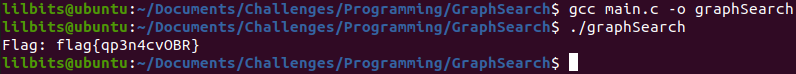
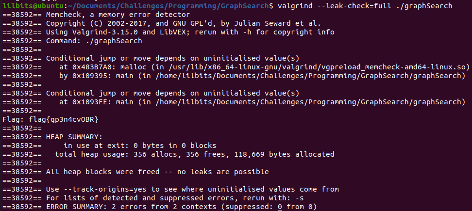

---
title: "CWE Challenge - Graph Search"
author: Michael Mendoza
date: "2023-01-28"
subject: "C Programming"
keywords: [CTF, C Programming, Screening]
lang: "en"
titlepage: true
title-page-color: "141d2b"
titlepage-rule-color: "11b925"
titlepage-text-color: "FFFFFF"
toc: true
toc-own-page: true
titlepage-background: "./images/titlePage.jpeg"
...

# Introduction

This problem required an adjacency list to be created before reading in the data from a binary file. After the data is read in, the shortest path is found using a depth-first search (DFS) algorithm to the node that has '}' as its value. 

# Graph Search using DFS

## Creating the Adjacency List

This was simple, I just created the struct to the specifications of what the README.md file gave me. Then, I used a double pointer to create the adjacency list.

```c
#include <stdio.h>
#include <stdlib.h>
#include <stdint.h>


// Structure to represent a node in the graph
typedef struct Node
{
    char val;
    uint16_t length;
    uint16_t *out;
} Node;
```
Inside of main(),
```c
// Create an array matrix to store the nodes of the graph
    Node **nodes = (Node **)malloc(sizeof(Node *));
    if(nodes == NULL)
    {
        exit(1);
    }
    int num_nodes = 0;
```
I created a num_nodes to help realloc memory as I read in more nodes. num_nodes will also help when I need to free the nodes at the end of the program. I used a double pointer because in essence, a pointer is an array, so a double pointer can be an array of arrays. This is exactly what an adjacency list is! Also I think using a double pointer for the graph just makes it look cleaner and easier to manage.

## Reading In the Binary File

To read in from a binary file, "rb" needs to be used followed by fread() to save the data at the address of a specified location. In this case, I use fread() to save the data in a node that is malloc'd.

```c
int main() {
    // Open the binary file for reading and parse the graph data
    FILE *fp = fopen("input_stream.bin", "rb");
    if (fp == NULL) {
        perror("Error opening file");
        return 1;
    }
```

```c
// Read the file until the end is reached
    while (!feof(fp)) {

        //create a new node to be read in
        Node *newNode = (Node *)malloc(sizeof(Node));
        if(newNode == NULL)
        {
            exit(1);
        }

        //increase the size of nodes to accommodate an extra row of nodes
        nodes = realloc(nodes, (num_nodes + 1) * sizeof(Node)); //num_nodes + 1 is the amount of rows in the matrix
        if (nodes == NULL)
        {
            exit(1);
        }
        nodes[num_nodes] = newNode; //placing the address of the new node in the matrix
        num_nodes++; //now increasing the size to account for the actual number of nodes in the matrix

        //Read the val and length values from the file
        fread(&newNode->val, sizeof(uint8_t), 1, fp);
        fread(&newNode->length, sizeof(uint16_t), 1, fp);

        // Read the out values from the file
        newNode->out = (uint16_t*) malloc(newNode->length * sizeof(uint16_t)); //allocate memory for all the out nodes
        if(newNode->out == NULL)
        {
            exit(1);
        }
        for (int i = 0; i < newNode->length; i++)
        {
            fread(&newNode->out[i], sizeof(uint16_t) , 1, fp); //read in all the neighbors
        }
    }
    fclose(fp);
    fp = NULL;
```

As the data was read in, "nodes" was increasing in size based off the number of nodes. I also ensured that anything that was malloc'd or realloc'd was checked to see if it came back as NULL. If it did, the program would exit instead of segfaulting. 
Each Node created had a pointer to an out, which I just increased the size of this pointer to be able to hold all its indexes. A pointer works just like an array, so in this case the pointer "out" is an array of indexes to its neighbors.

## Creating the Flag

Before finding the shortest path to create the flag, the flag variable needs to be created.

```c
char *flag = (char *) malloc(num_nodes* sizeof(char));  // Allocate a string to store the flag
    if (flag == NULL)
    {
        exit(1);
    }
```

The flag will be a char pointer that can hold all the values in our adjacency list if need be.

## Search Function

Depth-first search is an algorithm that can traverse this graph and find the path to the node we want.

```c
//recursive function to find and print the flag
int search(Node** nodes, int current, char* flag, int flagIndex)
{
    //the first and last iteration will automatically be saved
    flag[flagIndex] = nodes[current]->val;

    //check to see if current node has the char value we need
    if (nodes[current]->val == '}')
    {
        flag[flagIndex+1] = '\0';
        printf("Flag: %s\n", flag);
        return 1;
    }


    //recursively go through all the neighbor nodes
    //NOTE: Out refers to the destination node by index within the adjacency list
    for (int i = 0; i < nodes[current]->length; i++) {
        if (search(nodes, nodes[current]->out[i], flag, flagIndex + 1)) {
            return 1;
        }
    }
    return 0;
}
```

The "out" array in the "Node" struct holds the indexes of the neighboring nodes in the graph. The current node's out array is iterated over, and for each index, the search function is called recursively with the neighboring node as the new current node. This creates a depth-first search through the graph, following the edges (the out array) to explore new nodes until a node with the value '}' is found.

As the recursive function goes through the nodes, it saves the current node char value to flag. Once it reaches its destination node, it will print the flag and break out of the recursive function.

## Free Nodes

Finally we need to free the nodes so that there are no memory leakage in our program.

```c
void free_nodes(Node** nodes, int num_nodes)
{
    //iterate over every node in the graph
    for (int i = 0; i < num_nodes; i++)
    {
        //free each nodes out pointer as well as the current node
        free(nodes[i]->out);
        free(nodes[i]);
    }

    //finally, free the double pointer
    free(nodes);
}
```
# Compiling the Program

After compiling the program and making sure it works, we get our flag! 


\ **Figure 1:** Flag

## Memory Leakage

To check if memory was correctly freed, I used a tool called valgrind. 


\ **Figure 2:** Valgrind

Here we can see in the "Heap Summary" that all memory was freed and there are no memory leaks!

# Conclusion

Creating this program showcases how important knowing data structures is. Learning DFS and understanding how to use graphs was critical in finding the flag.

# References

1. [https://www.learn-c.org/](https://www.learn-c.org/)
2. [https://www.geeksforgeeks.org/dijkstras-shortest-path-algorithm-greedy-algo-7/](https://www.geeksforgeeks.org/dijkstras-shortest-path-algorithm-greedy-algo-7/)
3. [https://www.youtube.com/watch?v=nvRkFi8rbOM&t=484s](https://www.youtube.com/watch?v=nvRkFi8rbOM&t=484s)
4. [https://www.programiz.com/dsa/graph-dfs](https://www.programiz.com/dsa/graph-dfs)


