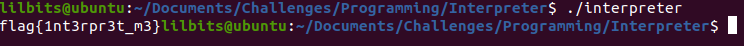
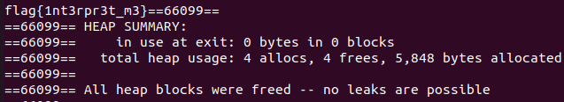

---
title: "CWE Challenge - Interpreter"
author: Michael Mendoza
date: "2023-01-29"
subject: "C Programming"
keywords: [CTF, C Programming, Screening]
lang: "en"
titlepage: true
title-page-color: "141d2b"
titlepage-rule-color: "11b925"
titlepage-text-color: "FFFFFF"
toc: true
toc-own-page: true
titlepage-background: "./images/titlePage.jpeg"
...

# Introduction

This challenge consists of implimenting a header file provided to accurately interpret the binary file. To do this, I created two functions from the "interpreter.h" file, sizeOfInstruction() and interpretByteArray(). This writeup will showcase how I used these two functions to interpret the binary file.

# Interpreter Program

## Function Declarations

At the start of the program, I make sure to include the "interpreter.h" file as will as "stdint.h". There are three functions total that I use in this program: sizeOfInstruction(), interpretByteArray(), and reverse(). 

```c
#include "interpreter.h"
#include <stdint.h>

//function declarations
int sizeOfInstruction(uint8_t opcode);
unsigned char reverse(uint8_t b);
void interpretByteArray(uint8_t *byteArray);
```
The code for these functions are written after the main function.

## Initialization

At the start of main(), a FILE pointer is created to read in bytes from the binary file.

```c
int main()
{
    FILE *fp = fopen(FILE_NAME, "rb");
    if (fp == NULL)
    {
        exit(1);
    }

    /*
     * read in the number of bytes and store them into a byte array
     */
    fseek(fp, 0, SEEK_END); //move the file pointer to the end of the file
    long numberOfBytes = ftell(fp); //save the number of bytes
    fseek(fp, 0, SEEK_SET); //move the file pointer back to the beginning of the file
```

The fseek() is used to traverse to the end of the file and ftell() will be used to save the byte count that the file pointer is pointing to. Then, fseek() is used again to set the file pointer back to the beginning of the file. Now, we can create the byte array that will save all the data from the binary.

```c
uint8_t *byteArray = malloc(numberOfBytes * sizeof(uint8_t)); //create the byte array
    if (byteArray == NULL)
    {
        exit(1);
    }

    //read in the bytes and place them in the byte array
    int i = 0;
    while (!feof(fp))
    {
        fread(&byteArray[i], sizeof(uint8_t),1, fp);
        i++;
    }
    fclose(fp);
    fp = NULL;
```

Memory is allocated to byteArray equal to the number of bytes in the file. After reading in the bytes, fclose() is used to close the file and the file pointer is set to NULL.

# Function Calls

At the end of main(), I run the following functions to interpret and print the flag as well as freeing the byte array.

```c
//function calls
    interpretByteArray(byteArray);
    free(byteArray);
    return 0;
}
```
The above code is the end of main, which means interpretByteArray() was really the only function I used in main(). However, the following functions were also used in this program.

## sizeOfInstruction()

This function will take a byte and return the size of the instruction that the byte represents.

```c
//used a function to receive the correct instruction length
int sizeOfInstruction(uint8_t opcode)
{
    switch(opcode)
    {
        case END:
        {
            return END_SIZE;
        }
        case JMP:
        {
            return JMP_SIZE;
        }
        case SWP:
        {
            return SWP_SIZE;
        }
        case ADD:
        {
            return ADD_SIZE;
        }
        case XOR:
        {
            return XOR_SIZE;
        }
        case INVERT:
        {
            return INVERT_SIZE;
        }
        case PRINT:
        {
            return PRINT_SIZE;
        }
        default:
        {
            printf("%s", "unknown opcode");
            break;
        }
    }
    return 0;
}
```

A switch statement is used to avoid going through nested if statements.

## reverse()

This function will take a byte and return the bytes in reverse order.

```c
/*
 * function to reverse the bits of a byte.
 * First the left four bits are swapped with the right four bits.
 * Then all adjacent pairs are swapped and then all adjacent single bits.
 * This results in a reversed order.
 */
 uint8_t reverse(uint8_t b) {
    b = (b & 0xF0) >> 4 | (b & 0x0F) << 4;
    b = (b & 0xCC) >> 2 | (b & 0x33) << 2;
    b = (b & 0xAA) >> 1 | (b & 0x55) << 1;
    return b;
}
```

I was thankfully able to obtain this code from stack overflow. The alternative to this function is to use a lookup table; using a lookup table would have technically been more efficient, but for this program, efficiency is not as necessary. If needed, the following is the lookup table I would have used from the same source.

```c
unsigned char reverse(unsigned char x)
{
    static const unsigned char table[] = {
        0x00, 0x80, 0x40, 0xc0, 0x20, 0xa0, 0x60, 0xe0,
        0x10, 0x90, 0x50, 0xd0, 0x30, 0xb0, 0x70, 0xf0,
        0x08, 0x88, 0x48, 0xc8, 0x28, 0xa8, 0x68, 0xe8,
        0x18, 0x98, 0x58, 0xd8, 0x38, 0xb8, 0x78, 0xf8,
        0x04, 0x84, 0x44, 0xc4, 0x24, 0xa4, 0x64, 0xe4,
        0x14, 0x94, 0x54, 0xd4, 0x34, 0xb4, 0x74, 0xf4,
        0x0c, 0x8c, 0x4c, 0xcc, 0x2c, 0xac, 0x6c, 0xec,
        0x1c, 0x9c, 0x5c, 0xdc, 0x3c, 0xbc, 0x7c, 0xfc,
        0x02, 0x82, 0x42, 0xc2, 0x22, 0xa2, 0x62, 0xe2,
        0x12, 0x92, 0x52, 0xd2, 0x32, 0xb2, 0x72, 0xf2,
        0x0a, 0x8a, 0x4a, 0xca, 0x2a, 0xaa, 0x6a, 0xea,
        0x1a, 0x9a, 0x5a, 0xda, 0x3a, 0xba, 0x7a, 0xfa,
        0x06, 0x86, 0x46, 0xc6, 0x26, 0xa6, 0x66, 0xe6,
        0x16, 0x96, 0x56, 0xd6, 0x36, 0xb6, 0x76, 0xf6,
        0x0e, 0x8e, 0x4e, 0xce, 0x2e, 0xae, 0x6e, 0xee,
        0x1e, 0x9e, 0x5e, 0xde, 0x3e, 0xbe, 0x7e, 0xfe,
        0x01, 0x81, 0x41, 0xc1, 0x21, 0xa1, 0x61, 0xe1,
        0x11, 0x91, 0x51, 0xd1, 0x31, 0xb1, 0x71, 0xf1,
        0x09, 0x89, 0x49, 0xc9, 0x29, 0xa9, 0x69, 0xe9,
        0x19, 0x99, 0x59, 0xd9, 0x39, 0xb9, 0x79, 0xf9,
        0x05, 0x85, 0x45, 0xc5, 0x25, 0xa5, 0x65, 0xe5,
        0x15, 0x95, 0x55, 0xd5, 0x35, 0xb5, 0x75, 0xf5,
        0x0d, 0x8d, 0x4d, 0xcd, 0x2d, 0xad, 0x6d, 0xed,
        0x1d, 0x9d, 0x5d, 0xdd, 0x3d, 0xbd, 0x7d, 0xfd,
        0x03, 0x83, 0x43, 0xc3, 0x23, 0xa3, 0x63, 0xe3,
        0x13, 0x93, 0x53, 0xd3, 0x33, 0xb3, 0x73, 0xf3,
        0x0b, 0x8b, 0x4b, 0xcb, 0x2b, 0xab, 0x6b, 0xeb,
        0x1b, 0x9b, 0x5b, 0xdb, 0x3b, 0xbb, 0x7b, 0xfb,
        0x07, 0x87, 0x47, 0xc7, 0x27, 0xa7, 0x67, 0xe7,
        0x17, 0x97, 0x57, 0xd7, 0x37, 0xb7, 0x77, 0xf7,
        0x0f, 0x8f, 0x4f, 0xcf, 0x2f, 0xaf, 0x6f, 0xef,
        0x1f, 0x9f, 0x5f, 0xdf, 0x3f, 0xbf, 0x7f, 0xff,
    };
    return table[x];
}
```

## interpretByteArray()

This function takes in a byte array and prints the flag

```c
void interpretByteArray(uint8_t *byteArray)
{
    int currentInstruction = 0;    //initialize current instruction

    while (1)
    {
        uint8_t opcode = byteArray[currentInstruction]; //initialize opcode
        int instructionLength = sizeOfInstruction(opcode); //retrieve the size of the instruction

        switch (opcode)
```

The beginning of this function will initialize the index of the current instruction. For example, the first instruction will be "byteArray[currentInstruction]". The while loop will take the current instruction and save it as a byte called opcode. This opcode will be passed to the sizeOfInstruction() to save the size of the current instruction to "instructionLength". Now, at the end of every case, the current instruction index can be updated by adding the "instructionLength" variable.

The opcode is passed to a switch statement to execute the correct code based on the instruction given.

```c
switch (opcode)
{
    case END:
    {
        return;
    }
    case JMP:
    {
        //save the offset as a signed int and move the current instruction
        int16_t offset = *(int16_t *)(byteArray + currentInstruction + 1); //cast the value as a signed integer
        currentInstruction += offset;
        break;
    }
```

Going down the same line as the header file, I started with the case "END" which will just return from the function call back to main(). The "JMP" case saves the offset and jumps to the byte from the current index to the index of the added offset in the byte array. 

```c
case SWP:
    {
        //swap the values at both indexes given
        uint8_t index1 = byteArray[currentInstruction+1]; //save the value of index1
        uint8_t index2 = byteArray[currentInstruction+2]; //save the value of index2
        uint8_t tmp = byteArray[index1]; //save the value of byte array at index1 to a tmp variable
        byteArray[index1] = byteArray[index2]; //set the value at index 1 equal to the value at index2
        byteArray[index2] = tmp; //set the value at index2 equal to the original value at index1
        currentInstruction += instructionLength;
        break;
    }
```

The "SWP" case save to indexes and then creates a temperary index which is equal to the first index. Saving the value to a temperary index allows the first index to be set to be equal to the second index. After this is done, the second index can be set to the temperary index which holds the original first index. Now they are swaped!

```c
case ADD:
    {
        //Add a constant unsigned int to the 4 bytes at the given byte index.
        uint8_t index = byteArray[currentInstruction+1];
        uint32_t adding = *(uint32_t *)(byteArray+currentInstruction+2); //cast the value to an unsigned integer
        *(uint32_t *)(byteArray + index) += adding; //add the value at the index indicated
        currentInstruction += instructionLength;
        break;
    }
```

This instruction simply adds the value given to the value at the given index, ensuring that the casting is done right ensures things are accurately interpreted. This is important for all the instructions.

```c
case XOR:
    {
        //Xor a constant long long to the 8 bytes at the given byte index.
        uint8_t index = byteArray[currentInstruction + 1];
        uint64_t xoring = *((uint64_t *)(byteArray + currentInstruction + 2)); //cast the value to a long long integer
        *((uint64_t *)(byteArray + index)) ^= xoring; //xor the value to the 8 bytes at the given byte index
        currentInstruction += instructionLength;
        break;
    }
```

This instruction xor's the byte given to the one at the given index of the byte array. These instructions seem simple, but the casting is not done correctly, then the interpretation will be off.

```c
case INVERT:
    {
        //reverse the order of the bits at the given index
        uint8_t index = byteArray[currentInstruction+1]; //
        byteArray[index] = reverse(byteArray[index]); //reverse the bits of the byte 
        currentInstruction += instructionLength;
        break;
    }
```

This instruction was easier to do because there is a function used to invert or reverse the bits in the byte at the given index.

```c
case PRINT:
    {
        //print the character given
        uint8_t asciiChar = byteArray[currentInstruction+1];
        printf("%c", asciiChar);
        currentInstruction += instructionLength;
        break;
    }
    default:
    {
        fprintf(stderr, "\nError: Invalid opcode %02x at instruction %d\n", opcode, currentInstruction);
        return;
    }
```

The PRINT instruction prints the byte simply enough. Since this is the end of the switch statement, I made sure to add a default case that will help me debug the program when an opcode was read in wrong. This happened mostly because I was flipping the bits in INVERT rather than reversing the bits. I would caution to read the instructions carefully.

# Compiling the Program

After compiling the program and making sure it works we get our flag! 


\ **Figure 1:** Flag

## Memory Leakage

To check and see if I freed the memory correctly I used a tool called valgrind. 


\ **Figure 2:** Valgrind

Here we can see in the "Heap Summary" that all memory was freed and there are no memory leaks!

# Conclusion

This challenge was interesting to do because I knew I would have to use a custom header file. Creating all the instructions for each opcode helped me understand how to cast variables and save the data accurately from the byte array.

# References

1. [https://www.geeksforgeeks.org/write-header-file-c/](https://www.geeksforgeeks.org/write-header-file-c/)
2. [https://www.techiedelight.com/find-size-of-file-c/](https://www.techiedelight.com/find-size-of-file-c/)
3. [https://www.tutorialspoint.com/c_standard_library/c_function_fseek.htm](https://www.tutorialspoint.com/c_standard_library/c_function_fseek.htm)
4. [https://stackoverflow.com/questions/2602823/in-c-c-whats-the-simplest-way-to-reverse-the-order-of-bits-in-a-byte](https://stackoverflow.com/questions/2602823/in-c-c-whats-the-simplest-way-to-reverse-the-order-of-bits-in-a-byte) 
