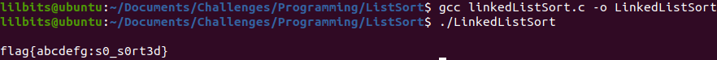
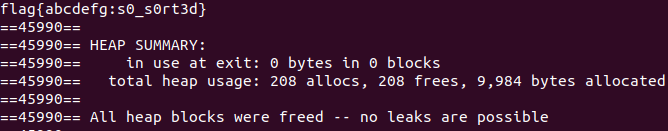

---
title: "CWE Challenge - List Sort"
author: Michael Mendoza
date: "2023-01-29"
subject: "C Programming"
keywords: [CTF, C Programming, Screening]
lang: "en"
titlepage: true
title-page-color: "141d2b"
titlepage-rule-color: "11b925"
titlepage-text-color: "FFFFFF"
toc: true
toc-own-page: true
titlepage-background: "./images/titlePage.jpeg"
...

# Introduction

To solve the challenge of sorting the data in the binary file, I decided to sort the data as it was being read in. This was easy to do because depending on the head node, the node being read in will either be placed before the head node or traverse through the linked list and be placed in the correct spot. The following shows the code used to sort and xor the linked list.

# Struct Creation and Function Declarations

For the struct, I added a back link or a "blink" to point to the previous node. This creates a doubly linked list and makes it easier to sort the data as its read in. Otherwise I accomadated the struct to match the data specified in the README.md file. Also, I like to add the functions declarations at the beginning and write the code for them after the main function. This makes it easier to read the code since the main function starts after the function declarations.

```c
//
// Created by Michael Mendoza on 8/18/22.
//
#include <stdio.h>
#include <stdlib.h>
#include <stdint.h>

/* Node Structure */
typedef struct node
{
    uint16_t value;
    uint16_t length;
    struct node *flink;
    struct node *blink;
    char *flag;
}NODE;

/* Function Declarations */

void print(NODE *node);
void xor(NODE *node, int maxLength);
void freeLinkedListNodes(NODE *node);
```

## Initializing Variables

At the start of the main function, a file pointer is created to read in the binary file. Three variable are also initialized; head, tail, and maxLength.

```c
int main()
{

    /*
     * open the file to read in the nodes for a linked list
    */
    FILE *fp = fopen("input_stream.bin", "rb");
    if (fp == NULL)
    {
        perror ("Error in opening the file.");
        return (-1);
    }


    //initializing variables
    NODE *head = NULL, *tail = NULL;    //included the tail node since this is a doubly linked list
    int maxLength = 0;                  //this is the max length of the flag piece that will be read in
```
    
The head variable will be of type Node that will point to the first node in the linked list. Tail will also be a Node, but it points to the end of the list. MaxLength will keep track of the largest length read into the nodes. This will help us allocate memory for the flag variable since we can allocate memory up to the longest flag piece.

# Reading In and Sorting Data

To read in the data, a while loop is used to continuously add nodes to the linked list until the end of the file is reached.

## New Node

At the start of the while loop, a new node will be created.

```c
while(1)
    {
        //allocating space for a new Node to be read-in
        NODE *newNode = (NODE *)malloc(sizeof(NODE));
        if (newNode == NULL)
        {
            exit(3);
        }
```

When using malloc to allocate memory, always check to make sure that the variable does not contain NULL. This can happen if the memory did not properly allocate.

## Reading in the Data

Using fread(), the data can be read in and saved in the NODE datatype at the specified locations. The "blink" variable is not read in because it is not part of the node structure when the binary file was created. We will manually add the "blink" variable later.

```c
//reading in the Node from the file and finding the max length of the flag pieces
        fread(&newNode->flink, sizeof(uint16_t), 1, fp);
        fread(&newNode->value, sizeof(uint16_t), 1, fp);
        fread(&newNode->length, sizeof(uint16_t), 1, fp);
        if (newNode->length > maxLength)
        {
            maxLength = newNode->length;
        }
```
The if statement will check to see if the current nodes flag length is greater than what maxLength is. If it is, then the current nodes flag length will be the new maxLength.

After reading in the length of the flag piece, memory is going to be malloc'd to accomodate the data. Then the flag piece will be read in.

```c
//the current length is used to allocate memory for the flag piece
        newNode->flag = (char *) malloc(newNode->length * sizeof(char));
        if(newNode->flag == NULL)
        {
            exit(2);
        }

        //once memory is allocated, read in the data from the file
        fread(newNode->flag, (newNode->length) * sizeof(char), 1, fp);
```

When reading in the data, it will be the product of the flag piece length and the size of the char variable.

## Creating the Linked List

Now that we have our new node, we will add it to the list. 

```c
//initializing the linked list
        if (head == NULL)
        {
            head = newNode;
            tail = newNode;
            head->flink = NULL;
            head->blink = NULL;
        }
        else
        {
            /*
             * smallest node value is going to be the head, so we check to see
             * if the new node is smaller than the head value, and if it is we
             * insert the node before the head value
             */
            if(newNode->value < head->value)
            {
                head->blink = newNode;
                newNode->flink = head;
                head = newNode;
            }

            else
            {
                //create a node to traverse through the list
                NODE *currentNode = head;
```
Above, we can see nested if else statements being used to check if the linked list needs to be initialized, if the node needs to be inserted at the beginning, or if the node needs to be traversed through the linked list. If the node needs to be traversed, then a temperary node "currentNode" will be created to save the value of the current node.
NOTICE: The blink variable is utilized when inserting the new node before the head.

## Linked List Traversal

If the node that was read in needs to be placed somewhere in the linked list, it can be done by traversing the list until a node is found that has a higher value. The node will then be placed behind it.

```c
//create a node to traverse through the list
        NODE *currentNode = head;

        /*
         * check to see if there is only one node, if there are no other nodes
         * in the list then the new node is the 2nd node and is initialized as such
        */
        if(head->flink == NULL)
        {
            newNode->blink = head;
            head->flink = newNode;
            tail = newNode;
            newNode->flink = NULL;
        }

        //if there's more than 2 node in the linked list
        else
        {
            /*
             * traverse through the list until you reach a node whose value
             * is greater than the new node and insert the node behind it
             */
            while (currentNode->flink != NULL && currentNode->flink->value < newNode->value)
            {
                currentNode = currentNode->flink;
            }
            newNode->flink = currentNode->flink;
            newNode->blink = currentNode;
            currentNode->flink = newNode;
        }
```
After creating a temperary node, an if else statement is used to assign the node in the case that there is only a head node available or if there are more than two nodes. In the second case, a while loop is performed with the condition that the current node flink is not null and that the next nodes value is less than the new node that was originally read in. Once it reaches a node where the current node value is greater than the new node value or the next node is NULL (last node in the list), it will exit the loop and perform the neccesary tasks of assigning the flink and blink to the new node. 

To ensure that the blink is set correctly, the current node will be set to be the next node in the list and then the next nodes blink will be assigned to the new node.

```c
if(newNode->flink != NULL)
        {
            currentNode = newNode->flink;
            currentNode->blink = newNode;
            if(currentNode->flink == NULL)
            {
                tail = currentNode;
            }
        }
```

## End of File

At the end of of the while loop, feof() is used to determine whether the end of the file has been reached. If it has, the loop will break and the program will exit the loop.

```c
//exit the while loop once the end of the file is reached
        if(feof(fp))
        {
            break;
        }
    }

    //close the file
    fclose(fp);
    fp = NULL;
```

Use fclose() to close the file then set the file pointer to NULL.

# Functions Used

At the end of main(), three functions were called. 

```c
//function calls
    //print(head);
    xor(head, maxLength);       //xor's and prints the flag
    freeLinkedListNodes(head);

    return 0;
}
```

I created the print function to test my code throughout the creation of the program, but commented it out for a cleaner output of the flag. Below the main function, the functions are created.

## Print()

This function will print the linked list and verify that the addresses are pointing to the correct node. It will also verify that the flag pieces are read in correctly based on the nodes length.

```c
void print(NODE *node)
{
    //traverse through the list and print the nodes
    for (; node != NULL; node = node->flink)
    {
        printf("%p %p %p %d %d %s\n", node->blink, node, node->flink, node->value, node->length, node->flag);
    }
}
```

## xor()

This function will create a flag array that will hold the value of flag as its traversed through the linked list and xoring all the even indexes. Once the list has been traversed, the flag will be printed and then freed.

```c
void xor(NODE *node, int maxLength)
{
    //created a node to traverse through the list
    NODE *current = node;

    /*
     * initialized the flag array to 0 with the size of the maximum sized flag piece
     * this allows the flag pieces to xor the flag array with no issues. 0 ^ anyChar = anyChar.
     */
    char *flagArray = (char *)calloc(maxLength, sizeof(char));
    if(flagArray == NULL)
    {
        exit(4);
    }


    while(current != NULL)
    {
        //iterate over even indexes
        if(current->value % 2 == 0)
        {
            //xor flag array with the flag piece up to the length of the current flag piece
            for (int i = 0; i < current->length; i++)
            {
                flagArray[i] ^= current->flag[i];
            }
        }
        current = current->flink;
    }
    printf("\n%s\n", flagArray);
    free(flagArray);
}
```

As seen above, I used calloc to allocate memory to the flag array. This is because calloc will initialize the variable to be an array of zero's. This is extremely usefull because anything xor'd with "0" is itself, meaning if a flag piece is read in and it is longer than current flags data, it'll xor up to the length of the current data and then finish xoring with "0" without any issues.

## free()

Lastly, we need to free all the char pointers and nodes in the linked list. This is as simple as iterating through the list just as we did to sort and print.

```c
void freeLinkedListNodes(NODE *node)
{
    //create a tmp node to free memory while traversing through the list
    NODE *tmp = NULL;

    while(node != NULL)
    {
        tmp = node;
        node = node->flink;
        free(tmp->flag);
        free(tmp);
    }
}
```
# Compiling the Program

After compiling the program and making sure it works we get our flag! 


\ **Figure 1:** Flag

## Memory Leakage

To check to see if I freed the memory correctly I used a tool called valgrind. 


\ **Figure 2:** Valgrind

Here we can see in the "Heap Summary" that all memory was freed and there are no memory leaks!

# Conclusion

This challenge was accomplished by using pointers to manipulate the data and accurately create the flag. Without knowlege in pointers, it would be harder to be able to accomplish this. 

# References

1. [https://www.learn-c.org/en/Linked_lists](https://www.learn-c.org/en/Linked_lists)
2. [https://www.geeksforgeeks.org/c-pointer-to-pointer-double-pointer/](https://www.geeksforgeeks.org/c-pointer-to-pointer-double-pointer/)
3. [https://www.geeksforgeeks.org/program-to-find-the-xor-of-ascii-values-of-characters-in-a-string/](https://www.geeksforgeeks.org/program-to-find-the-xor-of-ascii-values-of-characters-in-a-string/)
4. [https://www.programiz.com/dsa/linked-list-operations](https://www.programiz.com/dsa/linked-list-operations)


