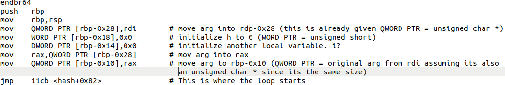
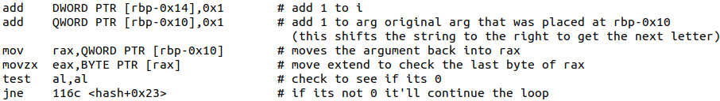
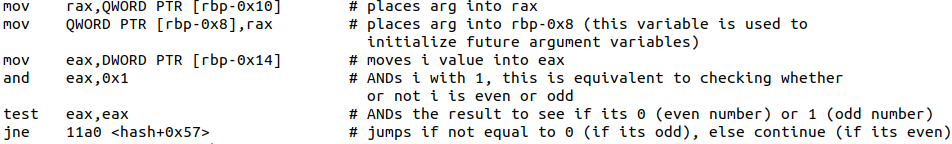
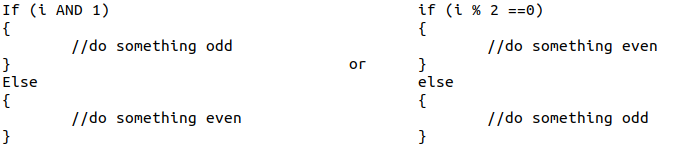
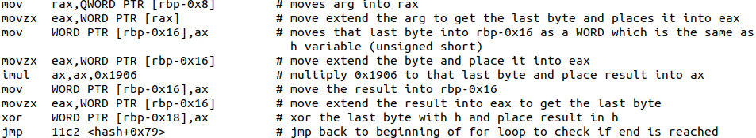
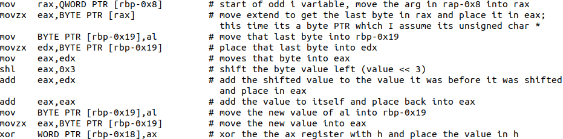
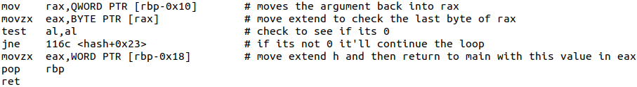
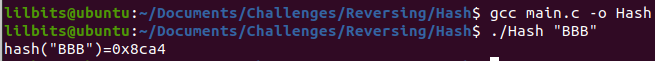

---
title: "CWE Challenge - Hash"
author: Michael Mendoza
date: "2023-01-25"
subject: "Reverse Engineering"
keywords: [CTF, Reverse Engineering, Screening]
lang: "en"
titlepage: true
title-page-color: "141d2b"
titlepage-rule-color: "11b925"
titlepage-text-color: "FFFFFF"
toc: true
toc-own-page: true
titlepage-background: "./images/titlePage.jpeg"
...

# Introduction

Given the assembly code for this challenge, I was able to make some comparisons to the c code that was also provided. The following shows my methodology into solving this challenge.

# Initialization

Since part of the initialization was given, it was easier to learn what some of the equivelent c code amounted to. Looking at the c code given,

```c
short hash(unsigned char * s){
	unsigned short h = 0;
	//complete me
	return h;
}
```
We can see that there was only one arguement passed through the function call. Since its the only arguement, we know that only the rdi register will hold the data that needs to be manipulated. 
 

\ **Figure 1:** Initializing the Variables

Since we know the rdi register is being used, we can see that the data from that register is being placed in QWORD PTR at rbp-0x28. So now we can note, QWORD PTR is the same as "unsigned char *". This is also seen right before the loop starts, at the variable located at rbp-0x10, which means another unsigned char pointer is initialized, and with the same data that was passed through the function call. 

Furthermore, we can see two variables being initialized to 0; one of them is the 'h' variable at rbp-0x18, and since its placed in a WORD PTR, we can assume future WORD PTR's are the datatype "unsigned short". 

The following is the code I came up with: 

```c
short hash(unsigned char * s){
    unsigned short h = 0;
    unsigned char *curr = s; //creating rbp-0x10
```

As for the other initialized variable rbp-0x14, I noticed that its incrementing after every iteration of the loop so I knew it was the "int i = 0;" typically used in a loop. I was able to see this after following the jump to "11cb". 

# For Loop


\ **Figure 2:** For Loop

The jump takes the program to right after both the rbp-0x14 and rbp-0x10 variables are incremented. After incrementing, rbp-0x10 was tested to see if it was 0 (or null), if its not, it'll jump to continue the loop. Since I already initialized rbp-0x10, the following for loop is what I came up with.

```c
for (int i = 0; *curr != '\0'; i++, curr++){
}
```

If the value of "curr" is not 0, then the loop continues. The program jumps to 116c.

Note: As the value of "curr" is incremented, the last byte is whats being shifted to the next character. So every iteration is just analyzing the next character in the value past into the function.


# If Else Statement


\ **Figure 3:** If Else Statement

This is where the if else statements starts within the for loop. Here we can see that a new variable is created at rbp-0x8, where the value of "curr" is saved into; because of this, whenever rbp-0x8 is used, I just use the value of "curr". Then the 'i' variable (rbp-0x14) is ANDed with 1. If the value is not 0, then the program will jump to "11a0". This can be written in two ways, either using the AND operator, or the modulus operator as such:


\ **Figure 4:** If Else Example

If we dont jump, we can see what happens in the even statement.

## If Even


\ **Figure 5:** Even Statement

Now we see rbp-0x8 being used to create another variable, rbp-0x16. Since we know rbp-0x8 is "curr", we can just cast "curr" to the datatype needed for rbp-0x16. Since a WORD PTR is used to create the variable, we know that it will be an "unsigned short" datatype because the 'h' variable was also a WORD PTR. The imul operator is used which just multiplies the 2 source operands and places the product in the destination operand; that value is then placed into rbp-0x16. Lastly, this value is xor'd with the 'h' variable before jumping back to the for loop. 

```c
if (i % 2 == 0) 
{
	unsigned short val = *(unsigned short *) curr; //creating rbp-0x16
	val *= 0x1906;
	h ^= val;
}    
```

Next we can see the odd statement from the following:

## If Odd


\ **Figure 6:** Odd Statement

The variable rbp-0x8 is used to create rbp-0x19, which means again we are going to use the value of "curr" to create the new variable. Since rbp-0x19 is a BYTE PTR, we are going to use an "unsigned char" datatype to create this variable. The new variable seems to be placed in two registers, eax and edx. The value in eax is shifted to the left by 3; this can be done in c using "<<". Now the original value is still in edx, and that is added to the new value that was shifted in eax. Which can look like this "(val << 3) + val". This value is then added to itself before being xor'd with the "h" variable and returned to the loop.

```c
else 
{
	unsigned char val = *curr; //creating rbp-0x19
	val = ((val << 3) + val) *2;
	h ^= val;
}
```

# Return Value

Lastly, the function call ends when the for loop hits null and breaks.


\ **Figure 7:** Return Value

# Final C Code

The final c code:

```c
short hash(unsigned char * s)
{
	unsigned short h = 0;
	unsigned char *curr = s; //creating rbp-0x10
	for (int i = 0; *curr != '\0'; i++, curr++)
	{
		if (i % 2 == 0) 
		{
			unsigned short val = *(unsigned short *) curr; //rbp-0x16
			val *= 0x1906;
			h ^= val;
		} 
		else 
		{
			unsigned char val = *curr; //creating rbp-0x19
			val = ((val << 3) + val) *2;
			h ^= val;
		}
	}
	return h;
}
```

After compiling the main.c file we created, we can get the flag.

# Flag


\ **Figure 8:** Flag

# Conclusion

This challenge was crazy. I learned so much about disassembly and how to do it manually. I know there was probably an easier option of turning the c code provided as well as the hash function into object files and linking them together to create the binary needed to get the flag, but learning how to reverse the assembly seemed more fun learn, especially since I wasn't on a time crunch to get this done. 

# References

1. [https://www.felixcloutier.com/x86/imul](https://www.felixcloutier.com/x86/imul)
2. [https://www.felixcloutier.com/x86/movzx](https://www.felixcloutier.com/x86/movzx)
3. [https://cs.brown.edu/courses/cs033/docs/guides/x64_cheatsheet.pdf](https://cs.brown.edu/courses/cs033/docs/guides/x64_cheatsheet.pdf)
4. [https://stackoverflow.com/questions/23367624/intel-64-rsi-and-rdi-registers](https://stackoverflow.com/questions/23367624/intel-64-rsi-and-rdi-registers)
