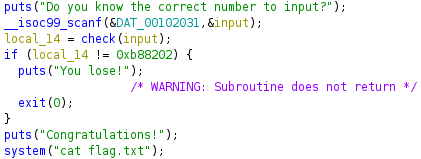
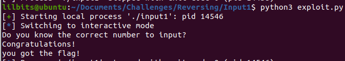

---
title: "CWE Challenge - Input1"
author: Michael Mendoza
date: "2023-01-21"
subject: "Reverse Engineering"
keywords: [CTF, Reverse Engineering, Screening]
lang: "en"
titlepage: true
title-page-color: "141d2b"
titlepage-rule-color: "11b925"
titlepage-text-color: "FFFFFF"
toc: true
toc-own-page: true
titlepage-background: "./images/titlePage.jpeg"
...

# Information Gathering

## Ghidra

We can decompile the program using Ghidra and take a look at the main function. 


\ **Figure 1:** Main Function

We can see that after reading in the users input, its checked against 0xb88202, or 193480725 in base 10. If the user did not enter this number, then the program will exit. If it passes this check, a system call to cat the flag.txt file is called.

# Creating the Exploit

To create the exploit, we will remotely connect using pwntools and then send the number needed to bypass the check. 

## Python Script

```
from pwn import *

target = remote('cweaccessionsctf.com', 1380)

target.sendline(b'193480725')
target.interactive()
```

# Flag


\ **Figure 2:** Flag

And it worked!

# Conclusion

Knowing the tools available to me to be able to decompile code is useful. In this case I used Ghidra, but using GDB or any other debugger and stepping through the problem would have been just as useful.
