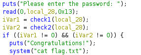
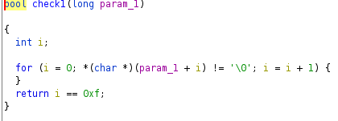
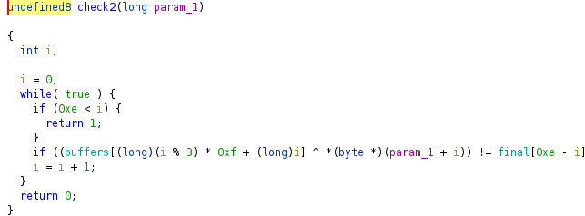
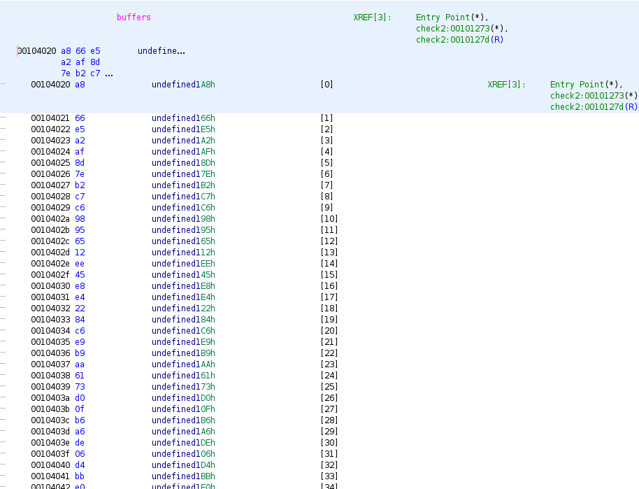
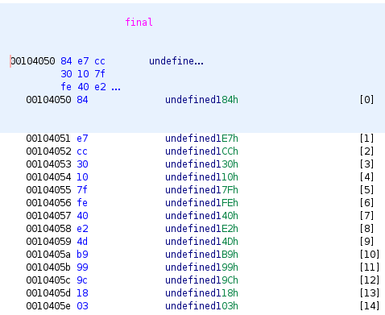
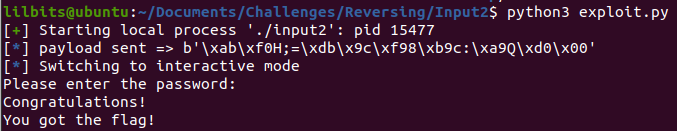

---
title: "CWE Challenge - Input2"
author: Michael Mendoza
date: "2023-01-21"
subject: "Reverse Engineering"
keywords: [CTF, Reverse Engineering, Screening]
lang: "en"
titlepage: true
title-page-color: "141d2b"
titlepage-rule-color: "11b925"
titlepage-text-color: "FFFFFF"
toc: true
toc-own-page: true
titlepage-background: "./images/titlePage.jpeg"
...

# Information Gathering

## Ghidra

Opening the binary in Ghidra, we see that program reads in 0x13 bytes from the user and does 2 checks before running the system call to cat the flag.txt file.


\ **Figure 1:** Main Function

# Check 1

Opening up the check1 function we see the following:


\ **Figure 2:** Check 1 Function

We can see that the first check returns true if the user enters 0xf, or 16 bytes of data. It does check for a null byte, so I made sure to add this to the end of payload.

# Check 2

Opening up check2 shows us the following:


\ **Figure 3:** Check 2 Function

Here we can see that the while loop takes the users input data and xor's it with one of the bytes in "buffers". If the byte doesnt correspond to the bytes in "final", then check2 will return false. 

## Buffers

The following is a constant set of numbers that will obtain a byte depending on what the value of i is in "buffers[(i % 3) * 0xf + i]."

Clicking into buffers shows all the bytes that are going to be xor'd with the users data.


\ **Figure 4:** buffers

Here we can see the bytes and there corresponding offsets, for example 0xa8 at offset 0 and 0x66 at offset 1. We can manually calculate what each byte obtained from buffers will be and xor it with the corresponding "final" byte so get what the user should enter.

## Final

After clicking into final, we can see what's expected after xoring the users input to the correct buffer bytes.


\ **Figure 5:** final

# Creating the Exploit

This exploit can be created by reversing the algorithm used to get to the "final" byte. By xoring the final byte with the corresponding buffers byte, you will get the byte that the user needed to input.

Esentially, we are using this methodology:

x ^ y = z

If x = buffers[(i % 3) * 0xf + i], y = user input, and z = final, then

y = x ^ z

So the user input is equal to buffers ^ final.

## Python Script
After hand-jamming the math for each byte needed, I came up with this payload.

```
#! /usr/bin/env python3

from pwn import *

target = process('./input2')


#went through ghidra and found the 2 checks.
#check2 contained the formula "buffers ^ userInput = final"
#which means, "final ^ buffers = userInput" which is the payload below
payload = b'\xab\xf0\x48\x3b\x3d\xdb\x9c\xf9\x38\xb9\x63\x3a\xa9\x51\xd0\x00'

#for check1, I ensured there was a null byte at the end of the payload

log.info(f'payload sent => {payload}')
target.sendline(payload)

target.interactive()
```

# Flag


\ **Figure 6:** Flag

# Conclusion

This challenge was only possible to reverse since the final bytes and the buffers bytes were constants. Knowing how to reverse the xor was key to solving this problem!

# References
1. [https://stackoverflow.com/questions/14279866/what-is-inverse-function-to-xor](https://stackoverflow.com/questions/14279866/what-is-inverse-function-to-xor)
